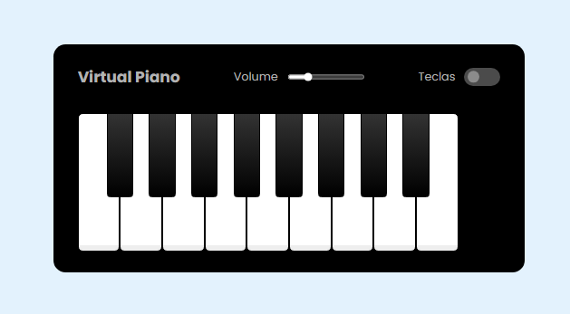

## 🧠 Projeto: Virtual Piano 🎹

Este projeto faz parte do **Bootcamp da [Digital Innovation One (DIO)](https://www.dio.me/)** e tem como objetivo o desenvolvimento de um **simulador de piano virtual** utilizando **HTML**, **CSS** e **JavaScript**.  

A aplicação permite ao usuário tocar notas musicais diretamente pelo teclado ou clicando nas teclas visuais do piano. Além disso, conta com controle de volume e a opção de exibir ou ocultar as letras correspondentes às teclas.

---

### 🚀 Tecnologias Utilizadas

- **HTML5** – Estrutura da interface  
- **CSS3** – Estilização e layout responsivo  
- **JavaScript (ES6)** – Lógica de reprodução sonora e interação com o DOM  

---

### 🧩 Funcionalidades Principais

- Reprodução de notas musicais ao clicar nas teclas ou pressionar as letras do teclado.  
- Controle de volume ajustável por slider.  
- Alternância para exibir/ocultar as letras nas teclas.  
- Efeitos visuais de interação ao pressionar as teclas.  

---

### 💻 Estrutura de Arquivos

```
📦 Projeto Virtual Piano
├── index.html           # Estrutura principal da aplicação
├── src/
│   ├── styles/
│   │   ├── main.css     # Estilos principais
│   │   └── reset.css    # Reset de estilo (não incluído)
│   ├── scripts/
│   │   └── engine.js    # Lógica JavaScript do piano
│   └── tunes/           # Arquivos de áudio das notas (.wav)
└── assets/
    └── preview.png       # Imagem de pré-visualização do projeto
```

---

### 🖼️ Preview



---

### 📚 Aprendizados

Durante o desenvolvimento deste projeto, foram reforçados os seguintes conceitos:

- Manipulação de eventos no DOM (`click`, `keydown`, `input`).  
- Uso de `querySelector` e `dataset` para vincular interações dinâmicas.  
- Aplicação de efeitos visuais com `classList.add()` e `setTimeout()`.  
- Integração de áudio com o objeto `Audio()` do JavaScript.  
- Customização de elementos com `range` e `checkbox` em CSS.  

---

### 🧑‍💻 Autoria e Créditos

**Desenvolvido por:** [MariAngelaNS](https://github.com/MariAngelaNs/Simulador-Piano)  
**Projeto educacional:** [Digital Innovation One (DIO)](https://www.dio.me/)  
**Base de aprendizado:** Bootcamp de Desenvolvimento Front-end  

**Scripts e estilos** revisados — não foram encontradas citações de autoria ou créditos externos dentro dos arquivos (`index.html`, `main.css`, `engine.js`). Todo o código parece original ou baseado em exemplos didáticos comuns a projetos da DIO.

---

### 🪄 Como Executar

1. Clone ou baixe este repositório:  
   ```bash
   git clone https://github.com/MariAngelaNs/Simulador-Piano.git
   ```

2. Abra o arquivo `index.html` no navegador.  

3. Certifique-se de que os arquivos de áudio (`.wav`) estejam presentes no diretório `src/tunes/`.  
